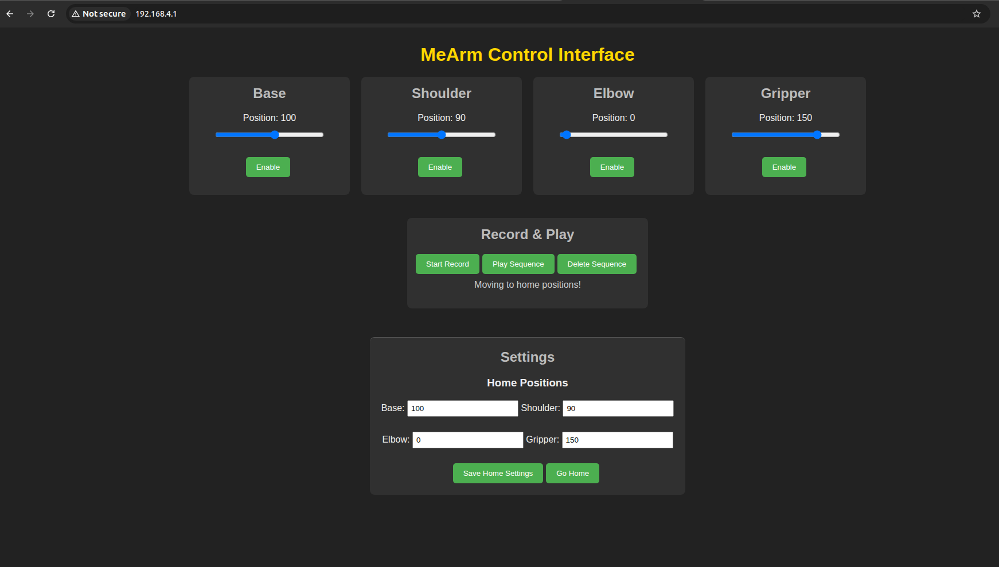

# MeArm ESP32 Controller

Control your MeArm with this fun web interface that lets you set a home position, record movements, and replay them. This project utilizes an ESP32 to host a Wi-Fi access point and a web server for controlling the MeArm robot arm.

## Table of Contents

- [Features](#features)
- [Hardware Required](#hardware-required)
- [Software Required](#software-required)
- [Pin Connections](#pin-connections)
- [Installation](#installation)
- [Usage](#usage)
- [Configuration](#configuration)
- [License](#license)
- [Acknowledgments](#acknowledgments)

## Features

This project provides the following features:

* **Wi-Fi Control:** Control your MeArm wirelessly through a web browser.
* **Individual Servo Control:** Adjust the position of the base, shoulder, elbow, and gripper servos using intuitive sliders.
* **Servo Enable/Disable:** Individually enable or disable each servo.
* **Home Position Setting:** Define and save a default "home" position for the MeArm.
* **Go Home Function:** Command the MeArm to return to the saved home position.
* **Movement Recording:** Record sequences of arm movements for later playback.
* **Movement Replay:** Play back recorded movement sequences to automate tasks.
* **Clear Status Feedback:** Get visual feedback on recording and playback status in the web interface.

## Hardware Required

* ESP32 Development Board
* MeArm Robotic Arm Kit
* 4 x Standard Hobby Servo Motors
* Separate Power Supply for ESP32
* Separate Power Supply for Servo Motors (4.8V - 6V recommended, check your servo specifications)
* Wiring for connecting the ESP32 to the servo motor signal pins and the separate power supply to the servo power and ground pins. **Ensure a common ground between the ESP32 and the servo power supply.**

## Software Required

* PlatformIO IDE (recommended) or Arduino IDE with ESP32 board support installed.
* ESP32Servo Library (will be managed by PlatformIO).
* Built-in Wi-Fi and WebServer libraries for ESP32 (included with ESP32 core).

## Pin Connections

Connect the servo motor signal wires to the following ESP32 GPIO pins:

* **Base Servo Signal:** GPIO Pin 13
* **Shoulder Servo Signal:** GPIO Pin 12
* **Elbow Servo Signal:** GPIO Pin 14
* **Gripper Servo Signal:** GPIO Pin 27

**Important:** Connect the positive (+) and negative (-) power leads of all servo motors to your **separate servo power supply**, not the ESP32. Ensure that the **ground (GND)** pin of the ESP32 is connected to the **ground (GND)** of your servo power supply to establish a common reference.

## Installation

1.  **Install PlatformIO IDE:** If you don't have it already, download and install PlatformIO IDE (available as a plugin for VS Code). You can find instructions here: [https://platformio.org/install](https://platformio.org/install)
2.  **Clone the Repository:** Clone this repository to your local machine using Git:
    ```bash
    git clone [https://github.com/Ashalen/MeArm_ESP32.git](https://github.com/Ashalen/MeArm_ESP32.git)
    ```
    (Replace the link with your actual repository URL if it's different)
3.  **Open the Project in PlatformIO:** Open the cloned folder in PlatformIO IDE.
4.  **PlatformIO Environment:** Ensure you have an environment configured for your ESP32 board in your `platformio.ini` file (PlatformIO should automatically handle the necessary ESP32 core and libraries).

## Usage

1.  **Connect the Hardware:** Connect the ESP32 to the MeArm servos according to the [Pin Connections](#pin-connections) section, remembering the separate power supplies and common ground.
2.  **Upload the Code:** Build and upload the project code to your ESP32 board using PlatformIO (usually by clicking the "Upload" button).
3.  **Connect to Wi-Fi:** After the ESP32 boots up, it will create a Wi-Fi access point (AP) named "MeArm\_Control" with the password "password". Connect your computer or smartphone to this Wi-Fi network.
4.  **Access Web Interface:** Open a web browser on your connected device and navigate to the IP address printed in the Serial Monitor (usually `http://192.168.4.1`).
5.  **Control the MeArm:**
    * Use the sliders on the web page to adjust the angles of the Base, Shoulder, Elbow, and Gripper. The current angle will be displayed next to the slider.
    * Click the "Enable" button next to each servo to allow it to move. The button will change to "Disable" when the servo is active.
    * To set the home position, adjust the sliders to your desired "home" pose, enter the values in the corresponding input fields in the "Settings" section, and click "Save Home Settings".
    * Click the "Go Home" button to command the enabled servos to move to the saved home positions.
    * To record a sequence of movements, click the "Start Record" button. The button will turn red and the status message will indicate recording has started. Move the servos through the desired sequence. Click "Stop Recording" when finished.
    * Click the "Play Sequence" button to play back the recorded movements.
    * Click the "Delete Sequence" button to clear any recorded movements.
  
## Web Interface

Here's a look at the web-based control interface:



## Configuration

You can configure the following aspects of the project:

* **Pin Assignments:** Modify the `const int` variables (`basePin`, `shoulderPin`, `elbowPin`, `gripperPin`) at the beginning of the `main.cpp` file to change the GPIO pins used for the servos.
* **Wi-Fi Credentials:** Change the `apSSID` and `apPassword` in the `main.cpp` file to customize the Wi-Fi access point. **It is strongly recommended to choose a more secure password.**
* **Default Home Positions:** The initial home positions are set in the `baseHome`, `shoulderHome`, `elbowHome`, and `gripperHome` variables in `main.cpp`. These can be changed directly in the code or via the web interface.
* **Servo Limits:** The code constrains servo movements between 0 and 180 degrees. You can adjust these limits within the `handleSetServo()` function if your servos have a different safe operating range.

## License

This project is licensed under the MIT License - see the [LICENSE](LICENSE) file for details.

## Acknowledgments

* This project utilizes the `ESP32Servo` library for controlling servo motors on the ESP32.
* The ESP32 platform and its built-in Wi-Fi and WebServer functionalities make this project possible.
* Built by AShalen GOvender using an open source robotics arm to contribute to opensource robotics.

---
